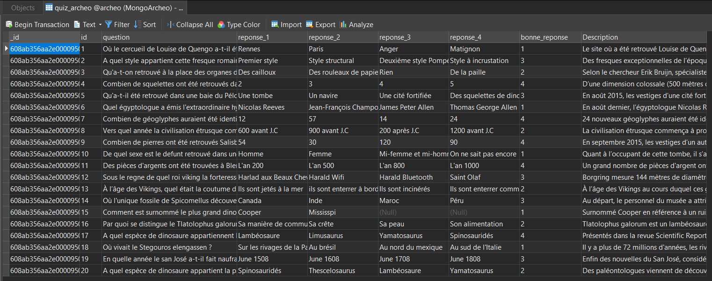
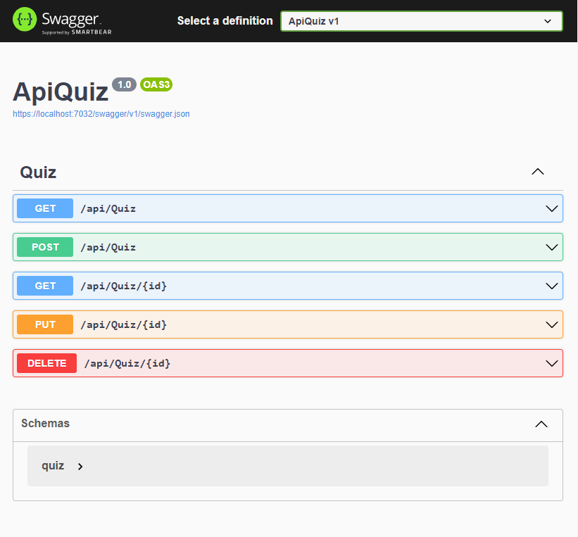

# Archeological Knowledge Quiz (AKQ)

## Application mobile XAMARIN Android

Cette application mobile est reliée à une API Rest permettant la gestion de questions (CRUD).

L'API a été créé avec ASP.NET Core et une base de données NoSQL MongoDB.

## Utilisaion du projet

### Création de la base de données

J'ai créé la base de données et sa data à partir d'articles sur l'archéologie.

Celle-ci est également utilisée dans le projet QuizGame (https://github.com/DinaBELRHAZI/QuizGame)

Utilisez le fichier quiz_archeo.csv pour créer votre bdd.

## Composition du projet

### ApiQuiz

ApiQuiz est une API Rest qui va intervenir sur la base de données dès lors qu'elle sera sollicitée. 

#### Swagger

### Application Xamarin Android

#### Menu Flyout 

Pour faciliter la navigation dans l'application, un menu flyout est accessible sur toutes les pages.

#### Liste des questions

#### Détails d'une question

#### Modifier une question

#### Ajout d'une question

#### Suppression d'une question

